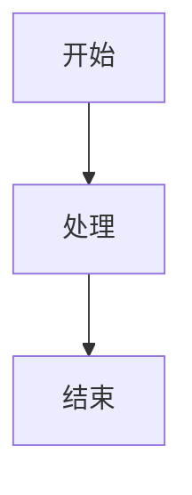

# Markdown 语法手册

> 面向软件工程师的 Markdown 快速参考指南
> 适用场景：GitHub README / 技术文档 / 笔记整理 / 博客写作

---

## 目录

1. [Markdown 是什么](#1-markdown-是什么)
2. [标题](#2-标题)
3. [段落与换行](#3-段落与换行)
4. [文字样式](#4-文字样式)
5. [列表](#5-列表)
6. [引用块](#6-引用块)
7. [代码块](#7-代码块)
8. [链接](#8-链接)
9. [图片](#9-图片)
10. [表格](#10-表格)
11. [分割线](#11-分割线)
12. [任务列表](#12-任务列表)
13. [转义字符](#13-转义字符)
14. [HTML 内嵌](#14-html-内嵌)
15. [扩展语法（GFM）](#15-扩展语法gfm)
16. [平台差异说明](#16-平台差异说明)
17. [常用模板](#17-常用模板)
18. [常见问题](#18-常见问题)

---

## 1. Markdown 是什么

**Markdown** 是一种轻量级标记语言，由 John Gruber 于 2004 年创建。它用纯文本格式编写，可转换为 HTML，广泛用于 README、文档、笔记和博客。

### 1.1 核心哲学

- **易读**：纯文本就有良好的可读性
- **易写**：符号直观，学习成本极低
- **可转换**：可导出为 HTML / PDF / 等格式

### 1.2 常用场景

| 场景     | 平台/工具                               |
| ------ | ----------------------------------- |
| 项目文档   | GitHub / GitLab / Gitee             |
| 技术博客   | 知乎 / 掘金 / CSDN / Medium             |
| 笔记     | Obsidian / Notion / Typora / VSCode |
| 技术手册   | 本手册所在目录                             |
| API 文档 | Swagger / Read the Docs             |
| 聊天消息   | Discord / Telegram（部分支持）            |

### 1.3 本手册约定

- ```` ``` ```` 包裹的代码块内"实际代码"表示 Markdown 源码
- 代码块外是渲染效果
- `GFM` = GitHub Flavored Markdown，GitHub 扩展语法

---

## 2. 标题

### 2.1 六级标题

```markdown
# 一级标题
## 二级标题
### 三级标题
#### 四级标题
##### 五级标题
###### 六级标题
```

渲染效果：

> # 一级标题
> ## 二级标题
> ### 三级标题
> #### 四级标题
> ##### 五级标题
> ###### 六级标题

### 2.2 标题规范

- `#` 后必须有一个**空格**
- 一行一个标题
- 文档有且仅有一个 `# 一级标题`（建议）
- 常见规范：`#` → 文档标题，`##` → 主要章节，`###` → 子章节

### 2.3 Setext 风格（不常用）

```markdown
一级标题
========

二级标题
--------
```

---

## 3. 段落与换行

### 3.1 段落

段落之间用**空行**分隔：

```markdown
这是第一个段落。
同一段落中换行不会分段。

这是第二个段落。需要空一行。
```

渲染效果：

这是第一个段落。
同一段落中换行不会分段。

这是第二个段落。需要空一行。

### 3.2 强制换行

行尾加**两个空格**：

```markdown
第一行··
第二行
```

> 有些平台（GitHub）不支持行尾空格换行，可改用 `<br>`

---

## 4. 文字样式

### 4.1 基础样式

````markdown
*斜体* 或 _斜体_
**粗体** 或 __粗体__
***粗斜体*** 或 ___粗斜体___
~~删除线~~
`行内代码`
<u>下划线</u>
<mark>高亮</mark>
H~2~O（下标，部分平台支持）
X^2^（上标，部分平台支持）
````

渲染效果：

- *斜体* 或 _斜体_
- **粗体** 或 __粗体__
- ***粗斜体*** 或 ___粗斜体___
- ~~删除线~~
- `行内代码`
- <u>下划线</u>
- <mark>高亮</mark>
- H~2~O（下标）
- X^2^（上标）

### 4.2 组合使用

```markdown
**粗体中的*斜体***
***全部粗斜体***
~~**粗体删除线**~~
```

渲染效果：

**粗体中的*斜体***  
***全部粗斜体***  
~~**粗体删除线**~~

### 4.3 颜色（非标准语法，仅部分平台支持）

```markdown
<font color="red">红色文字</font>
<span style="color:blue">蓝色文字</span>
```

---

## 5. 列表

### 5.1 无序列表

```markdown
- 项目 A
- 项目 B
  - 子项目 B1（前缩进 2 或 4 空格）
  - 子项目 B2
- 项目 C
```

也支持 `*` 和 `+`，但建议统一用 `-`。

渲染效果：

- 项目 A
- 项目 B
  - 子项目 B1
  - 子项目 B2
- 项目 C

### 5.2 有序列表

```markdown
1. 第一步
2. 第二步
   1. 子步骤 2.1
   2. 子步骤 2.2
3. 第三步
```

渲染效果：

1. 第一步
2. 第二步
   1. 子步骤 2.1
   2. 子步骤 2.2
3. 第三步

> 序号数字不必连续，会自动重排。`1.` 后建议统一从 1 开始。

### 5.3 混合列表

```markdown
1. 主题一
   - 细节 A
   - 细节 B
2. 主题二
   1. 子主题 1
   2. 子主题 2
      - 子项目的细节
```

渲染效果：

1. 主题一
   - 细节 A
   - 细节 B
2. 主题二
   1. 子主题 1
   2. 子主题 2
      - 子项目的细节

### 5.4 缩进规则

```
- 一级
  - 二级（缩进 2 空格）
    - 三级（缩进 4 空格）
```

> 大部分解析器 2 或 4 空格均可，保持统一即可。

---

## 6. 引用块

### 6.1 基本引用

```markdown
> 这是一段引用
```

渲染效果：

> 这是一段引用

### 6.2 多行引用

```markdown
> 第一行
> 第二行
>
> 中间有空段落的引用
```

渲染效果：

> 第一行
> 第二行
>
> 中间有空段落的引用

### 6.3 嵌套引用

```markdown
> 一级引用
>
> > 二级引用
> >
> > > 三级引用
```

渲染效果：

> 一级引用
>
> > 二级引用
> >
> > > 三级引用

### 6.4 引用内使用其他语法

```markdown
> ## 引用中的标题
>
> - 项目列表
> - 第二项
>
> `代码块` **粗体** *斜体*
```

渲染效果：

> ## 引用中的标题
>
> - 项目列表
> - 第二项
>
> `代码块` **粗体** *斜体*

---

## 7. 代码块

### 7.1 行内代码

```markdown
使用 `print("hello")` 输出内容。
```

渲染效果：使用 `print("hello")` 输出内容。

### 7.2 多行代码块

````markdown
```python
def hello():
    print("Hello, Markdown!")
```
````

渲染效果：

```python
def hello():
    print("Hello, Markdown!")
```

### 7.3 语言标识

````markdown
```python     # Python 语法高亮
```javascript # JavaScript
```go         # Go
```bash       # Shell 脚本
```json       # JSON
```yaml       # YAML
```sql        # SQL
```diff       # 差异对比
```html       # HTML
```
````

### 7.4 不指定语言（无高亮）

````markdown
```
这是纯文本代码块，无语法高亮
```
````

### 7.5 代码块内包含反引号

`````markdown
````
```
嵌套的三反引号
```
````
`````

### 7.6 Diff 高亮

````markdown
```diff
+ 新增的行
- 删除的行
 未变化的行
```
````

渲染效果：

```diff
+ 新增的行
- 删除的行
 未变化的行
```

---

## 8. 链接

### 8.1 内联式链接

```markdown
[显示文本](https://example.com)
[带标题的链接](https://example.com "鼠标悬停时的提示")
```

渲染效果：[显示文本](https://example.com)

### 8.2 引用式链接

```markdown
[点击这里][my-link]

[my-link]: https://example.com "可选标题"
```

适用于长 URL 或多次复用的链接。

### 8.3 自动链接

```markdown
<https://example.com>
<email@example.com>
```

渲染效果：<https://example.com>

### 8.4 相对路径链接

```markdown
[目录](../docs/index.md)
[同一文件夹下文件](./other.md)
```

### 8.5 锚点链接（跳转到标题）

```markdown
[跳转到代码章节](#7-代码块)
```

> 锚点自动生成规则：标题转小写、空格转连字符、去除非字母数字字符。

### 8.6 引用链接（类似脚注）

```markdown
正文内容需要引用[^1]。

[^1]: 这是脚注内容。
```

---

## 9. 图片

### 9.1 基础语法

```markdown


```

语法和链接类似，前面加 `!`，渲染为图片。

### 9.2 相对路径图片

```markdown


```

### 9.3 带链接的图片

```markdown
[](https://example.com)
```

### 9.4 调整宽高（非标准）

```markdown

```

---

## 10. 表格

### 10.1 基本表格

```markdown
| 左对齐 | 居中对齐 | 右对齐 |
| :----- | :------: | -----: |
| 单元格 | 单元格   | 单元格 |
| 第二行 | 第二行   | 第二行 |
```

渲染效果：

| 左对齐 | 居中对齐 | 右对齐 |
| :----- | :------: | -----: |
| 单元格 | 单元格   | 单元格 |
| 第二行 | 第二行   | 第二行 |

### 10.2 对齐方式

| 语法 | 对齐 | 说明 |
|---|---|---|
| `:---` | 左对齐 | 冒号在左 |
| `:---:` | 居中对齐 | 两侧冒号 |
| `---:` | 右对齐 | 冒号在右 |
| `---` | 默认左对齐 | 无冒号 |

### 10.3 表格内语法

```markdown
| 功能     | 示例                         |
| -------- | ---------------------------- |
| 加粗     | `**粗体**`                   |
| 代码     | `` `code` ``                 |
| 链接     | [点击](url)                  |
| 折行     | <br>                         |
```

### 10.4 表格注意事项

- 表头分隔行 `|---|` 不可省略（至少一个 `-`）
- 单元格内的竖线 `|` 需要用 `\|` 转义
- 某些平台（WhatsApp）不支持表格，建议用列表代替
- GitHub 表格支持单元格合并：❌ 不支持

---

## 11. 分割线

```markdown
---

***

___
```

渲染效果（三者效果一致）：

---

> 三个以上减号 `-`、星号 `*`、下划线 `_` 均可生成水平线。

---

## 12. 任务列表

### 12.1 基础用法

```markdown
- [x] 已完成的任务
- [ ] 未完成的任务
- [ ] 待做事项
```

渲染效果：

- [x] 已完成的任务
- [ ] 未完成的任务
- [ ] 待做事项

### 12.2 嵌套任务列表

```markdown
- [ ] 大项目
  - [x] 子任务 A
  - [ ] 子任务 B
- [x] 另一个大项目
```

> 任务列表是 GFM 扩展语法，并非所有平台都支持。

---

## 13. 转义字符

用反斜杠 `\` 转义 Markdown 特殊字符：

```markdown
\*   星号（避免被解释为斜体/粗体）
\#   井号（避免被解释为标题）
\-   连字符（避免被解释为列表）
\.   点号（避免被解释为有序列表）
\[   方括号
\]   方括号
\(   圆括号
\)   圆括号
\!   感叹号
\`   反引号
\    空格（行尾反斜杠 = 换行）
```

### 示例

```markdown
\# 这不是标题，这是纯文本
\*这不是斜体\*
```

渲染效果：

\# 这不是标题，这是纯文本
\*这不是斜体\*

---

## 14. HTML 内嵌

Markdown 允许在文档中嵌入 HTML 标签，实现更复杂的布局。

### 14.1 常用 HTML 标签

```markdown
<details>
<summary>点击展开</summary>

这是折叠内容。

- 列表项 1
- 列表项 2

</details>
```

渲染效果：

<details>
<summary>点击展开</summary>

这是折叠内容。

- 列表项 1
- 列表项 2

</details>

### 14.2 其他有用标签

```markdown
<kbd>Ctrl</kbd> + <kbd>C</kbd>  <!-- 键盘按键 -->
<br>                              <!-- 强制换行 -->
<center>居中内容</center>          <!-- 居中（部分平台支持） -->
<hr>                              <!-- 分割线 -->

<!-- 注释（不会显示在渲染结果中） -->
```

### 14.3 上标/下标

```markdown
X<sub>1</sub> + Y<sup>2</sup>
```

X<sub>1</sub> + Y<sup>2</sup>

---

## 15. 扩展语法（GFM）

GFM = GitHub Flavored Markdown，GitHub 使用的扩展标准，被 GitLab / Gitee 等广泛采纳。

### 15.1 自动链接 URL

GFM 下裸 URL 自动转为链接：`https://github.com`

### 15.2 删除线

像普通 Markdown 一样：`~~删除线~~`

### 15.3 Emoji

```markdown
:smile: :thumbsup: :rocket: :fire:
```

渲染效果：😄 👍 🚀 🔥

### 15.4 表格（见第十章）

GFM 开始才规范化了表格语法。

### 15.5 任务列表（见第十二章）

### 15.6 代码块围栏

GFM 无需缩进就能创建代码块，用三反引号 ` ``` ` 包裹。

### 15.7 Mentions / References

```markdown
@username
#123    （Issue 引用）
@org/team-name
```

### 15.8 Mermaid 图表（部分平台）

````markdown

````

### 15.9 数学公式（LaTeX）

部分平台支持（GitHub 支持）：

```markdown
行内公式：$E = mc^2$

块级公式：
$$
\sum_{i=1}^{n} i = \frac{n(n+1)}{2}
$$
```

---

## 16. 平台差异说明

不同平台对 Markdown 的解析存在差异，以下是常见平台注意事项：

### 16.1 GitHub / GitLab / Gitee

| 特性 | 支持情况 |
|---|---|
| 任务列表 `[x]` | ✅ 完整支持，可勾选 |
| Emoji `:smile:` | ✅ 完整支持 |
| Mermaid 图表 | ✅ 支持 |
| 数学公式 | ✅ 支持（$$） |
| 折叠 `<details>` | ✅ 支持 |
| 表格 | ✅ 完整支持 |
| 行尾双空格换行 | ❌ 不生效 |

### 16.2 Discord / Telegram

```markdown
**粗体**  *斜体*  __下划线__  ~~删除线~~
||隐藏文本||  `行内代码`
> 引用
- 列表
```

| 特性 | Discord | Telegram |
|---|---|---|
| 表格 | ❌ | ❌ |
| 任务列表 | ❌ | ❌ |
| 代码块 | ` ``` ` | ` ``` ` |
| 引用 | ✅ | ✅ |
| 标题 `#` | ❌（用 `## ` 缩略） | ❌ |

### 16.3 知乎 / 掘金 / CSDN

| 平台 | 说明 |
|---|---|
| 知乎 | 富文本编辑器，不完全支持 Markdown |
| 掘金 | 支持 Markdown + 自定义扩展 |
| CSDN | 支持 Markdown，有自定义语法 |

### 16.4 Obsidian / Typora

| 特性 | Obsidian | Typora |
|---|---|---|
| 内部链接 | `[[双链]]` | ❌ |
| 标签 | `#tag` | ❌ |
| 进度条 | ⚠️ 插件 | ❌ |
| 所见即所得 | ❌ | ✅ |

---

## 17. 常用模板

### 17.1 README 模板

```markdown
# 项目名称

> 一句话简介


## 简介

简短描述项目做什么、为什么做。

## 快速开始

### 环境要求

- Python 3.10+
- Node.js 18+

### 安装

```bash
git clone https://github.com/user/project.git
cd project
pip install -r requirements.txt
```

### 使用

```bash
python main.py
```

## 目录结构

```
project/
├── src/
├── tests/
├── docs/
└── README.md
```

## API

| 方法 | 路径 | 说明 |
|------|------|------|
| GET  | /api/v1/items | 获取列表 |
| POST | /api/v1/items | 创建项目 |

## 贡献指南

1. Fork 本仓库
2. 创建特性分支 (`git checkout -b feature/amazing`)
3. 提交改动 (`git commit -m 'Add amazing feature'`)
4. 推送 (`git push origin feature/amazing`)
5. 创建 Pull Request

## 许可证

MIT © Your Name
```

### 17.2 问题记录模板

```markdown
# Bug / 问题记录

## [BUG] 标题
- **状态**: 待修复 / 修复中 / 已完成
- **优先级**: P0 / P1 / P2
- **发现日期**: 2026-05-04
- **发现人**: @username

### 描述
复现步骤：
1. 打开页面
2. 点击按钮
3. 出现 500 错误

### 期望行为
页面正常返回结果

### 实际行为
返回 500 Internal Server Error

### 环境
- OS: Ubuntu 22.04
- 浏览器: Chrome 120
- 版本: v2.3.1

### 日志
```log
ERROR 500: Internal Server Error
  File "/app/main.py", line 42, in handler
    ...
```

### 解决方案
```
修改 `/app/main.py` 第 42 行，增加 None 检查。
```
```

### 17.3 技术笔记模板

```markdown
# 主题：笔记标题

## 概述

...

## 核心概念

### 概念一

...

### 概念二

...

## 代码示例

```python
print("hello")
```

## 踩坑记录

### 问题
遇到什么问题

### 原因
根本原因

### 解决方案
怎么解决的

## 参考

- [链接 1](url1)
- [链接 2](url2)
```

---

## 18. 常见问题

### Q: 如何在表格中显示竖线 `|`？

A: 用 HTML 实体 `&#124;` 或 `\|`（视解析器而定）。

```markdown
| 字符 | 转义 |
|------|------|
| `|`  | `&#124;` |
```

### Q: 如何在代码块中显示 Markdown 语法？

A: 用更多反引号包裹。比如在代码块中展示三反引号：

`````markdown
````
```
这里的三反引号被当做普通文字
```
````
`````

### Q: 为什么我的链接不生效？

A: 常见原因：
- URL 缺少协议（需要 `https://` 开头）
- 括号未转义（URL 含括号时用 `%28` `%29`）
- 锚点标题名不匹配（注意中英文符号差异）

### Q: 为什么不建议用 Tab 缩进列表？

A: 不同平台对 Tab 解释不同（2/4/8 格），建议统一用空格。

### Q: 如何在 Markdown 中写注释？

A: HTML 注释 `<!-- 注释内容 -->`。部分平台也支持脚注 `[^1]`。

### Q: 包含空格的 URL 怎么处理？

A: 用 `%20` 编码空格，或 `<url>` 语法。

### Q: 如何让 Markdown 换行？

A: 有三种方式：
1. 行尾加两个空格
2. `<br>`（推荐，跨平台兼容）
3. 空行（产生新段落，间距更大）

---

## 附录

### A. 快速参考卡片

```markdown
#       → 一级标题
##      → 二级标题
** **   → 粗体
* *     → 斜体
~~ ~~   → 删除线
`code`  → 行内代码
```lang → 代码块
>       → 引用
-       → 无序列表
1.      → 有序列表
- [x]   → 任务已完成
[text]  → 链接
![alt]  → 图片
|      | → 表格
---     → 分割线
```

### B. 推荐 Markdown 编辑器

| 编辑器 | 平台 | 特点 |
|---|---|---|
| **Typora** | Win/Mac/Linux | 所见即所得，最易上手 |
| **Obsidian** | Win/Mac/Linux/Mobile | 知识管理，双链笔记 |
| **VSCode** | Win/Mac/Linux | 内置预览，插件丰富 |
| **MarkText** | Win/Mac/Linux | 开源 Typora 替代 |
| **HackMD** | Web | 实时协作 |
| **Notion** | Web/App | 多功能文档+数据库 |

### C. 在线工具

- [Markdown 在线编辑器](https://dillinger.io/)
- [表格生成器](https://www.tablesgenerator.com/markdown_tables)
- [Emoji 速查](https://www.webfx.com/tools/emoji-cheat-sheet/)
- [GitHub Markdown 指南](https://docs.github.com/zh/get-started/writing-on-github)

---

> **手册版本**: v1.0 | **最后更新**: 2026-05-04
> 参考：GitHub Flavored Markdown Spec / CommonMark Spec
